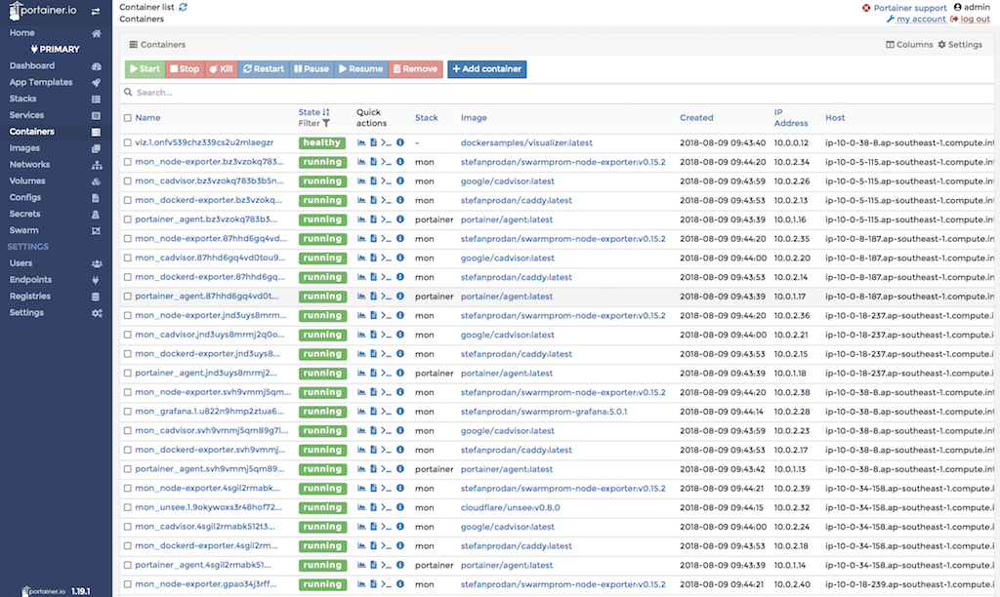
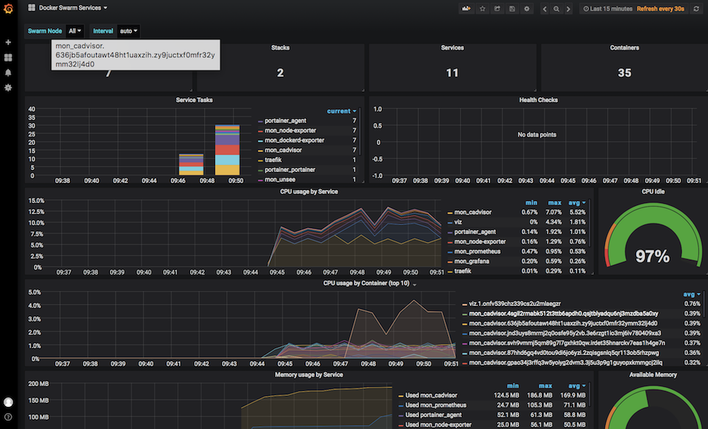

# swarm in AWS by terraform (for studying)


## used in
* coreos ami
* bastion host for ssh
* 8080 for traefik reverse proxy
* 8081 for traefik dashboard
* frontend-elb-address/viz/: [visualization containers in nodes](https://github.com/dockersamples/docker-swarm-visualizer)
* frontend-elb-address/portainer/: [swarm management](https://portainer.io/)
* frontend-elb-address/grafana: [monitoring for nodes, services](https://grafana.com/)
* frontend-elb-address/prom: [monitoring for nodes, services](https://prometheus.io/)

## monitoring applications





## pre-requirements
* aws cli
* aws credentical
* terraform cli

## how to use `swarm-cluster` module
```
provider "aws" {
  region = "ap-southeast-1"
}

module "swarm" {
  source = "github.com/zironycho/swarm-aws-terraform//modules/swarm-cluster"
  
  num_managers = 2
  num_workers = 4
  instance_types {
    manager = "t2.micro"
    worker = "t2.micro"
  }
}
```

### more variables for `swarm-cluster` module
```
module "swarm" {
  
  ...

  # limit IP block to access monitoring services
  http_cidr_blocks = [
    "your.public.ip/32",
  ]

  # limit IP v6 block to access monitoring services
  http_ipv6_cidr_blocks = []

  # add frontend monitoring url record in route53
  route53_enabled     = true
  route53_zone_name   = "example.com."
  route53_record_name = "mon.example.com"

  # enable rexray s3fs, ebs
  aws_accesskey       = "aws access key"
  aws_secretkey       = "aws private key"

  # enable quay.io private repository
  quay_username       = "user name or bot name"
  quay_password       = "user password or bot password"
}
```

### add custom ALB
```
module "custom_alb" {
  source = "github.com/zironycho/swarm-aws-terraform//modules/swarm-alb"
  # fixed: Don't change it. It is swarm's setting. 
  lb_name             = "frontend"
  bastion_group_name  = "bastion_group"

  # set your ALB
  vpc_id              = "input your vpc id"
  name                = "input new alb's name"
  swarm_port          = port for alb listener: published port in swarm ingress network

  # using pre-created ssl certification by aws
  ssl_enabled         = true
  acm_domain          = "example.com"

  # add record in route53 for ALB
  route53_enabled     = true
  route53_zone_name   = "example.com."
  route53_record_name = "api.example.com"
}
```

## example

### checkout 3 files in `/example`:
* main.tf
* outputs.tf
* Makefile

### create cluster
```
$ cd example
$ terraform init
$ terraform apply
data.external.version: Refreshing state...
data.aws_availability_zones.az: Refreshing state...
data.aws_ami.coreos_ami: Refreshing state...
...
Plan: 39 to add, 0 to change, 0 to destroy.

Do you want to perform these actions?
  Terraform will perform the actions described above.
  Only 'yes' will be accepted to approve.

  Enter a value: yes

...
W+OlXKEgkxKRvOuBJX88Fr6DHorsVDRimdFaIlIWq4uIQj3pRfEpMgyqu+M=
-----END RSA PRIVATE KEY-----

services = [
    http://traefik-dashboard-xxxxx.elb.amazonaws.com,
    http://frontend-yyyyy.elb.amazonaws.com/viz/,
    http://frontend-yyyyy.elb.amazonaws.com/grafana,
    http://frontend-yyyyy.elb.amazonaws.com/prom,
    http://frontend-yyyyy.elb.amazonaws.com/portainer/
]
```

### basic monitoring services
```
$ make services
http://traefik-dashboard-xxxxx.elb.amazonaws.com,
http://frontend-yyyyy.elb.amazonaws.com/viz/,
http://frontend-yyyyy.elb.amazonaws.com/grafana,
http://frontend-yyyyy.elb.amazonaws.com/prom,
http://frontend-yyyyy.elb.amazonaws.com/portainer/
```

### connect master node
```
$ make key
$ make ssh 
```

### any swarm node
```
$ make nodes
10.0.5.49,
10.0.4.59,
10.0.1.105,
10.0.14.132,
10.0.9.219,
10.0.15.113,
10.0.10.172
$ make ssh-node addr=one_of_private_node_address_in_swarm
```

## TODO
* [x] vpc
* [ ] asg
* [ ] nat
* [x] multiple az
* [x] rexray s3fs, ebs
* [x] quay.io private registry
