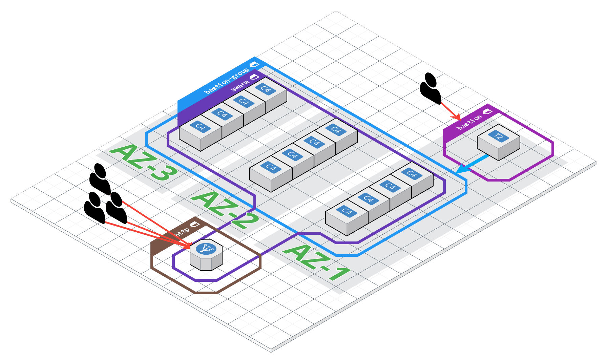

# swarm in AWS by terraform (for studying)


## used in
* bastion host for ssh
* 8080 for traefik reverse proxy
* 8081 for traefik dashboard
* frontend-elb-address/viz/: visualization containers in nodes
* frontend-elb-address/portainer/: swarm management
* frontend-elb-address/grafana: monitoring for nodes, services
* frontend-elb-address/prom: monitoring for nodes, services

## pre-requirements
* aws cli
* aws credentical
* terraform cli

## how to use
```
$ terraform init
$ terraform apply
```

## get monitoring service urls
```
$ make services
```

## connect ssh

get private key first.
```
$ make key
```

### master swarm node
```
$ make ssh
```

### any swarm node
```
# Get private node address in swarm
$ make nodes

$ make ssh-node addr=one_of_private_node_address_in_swarm
```
## configures

### change your instance types
```
# in terraform.tfvars
instance_types = {
  "manager" = "t2.micro"
  "worker" = "t2.micro"
}
```

### change your region & amis
I am using coreos ami. If you want to change region please check coreos ami in [here](https://coreos.com/os/docs/latest/booting-on-ec2.html).
```
# in terraform.tfvars
region = "ap-southeast-1"
```

## community modules
* [coreos ami](https://github.com/terraform-community-modules/tf_aws_coreos_ami)

## TODO
[v] vpc
[ ] asg
[ ] nat
[ ] multiple az
